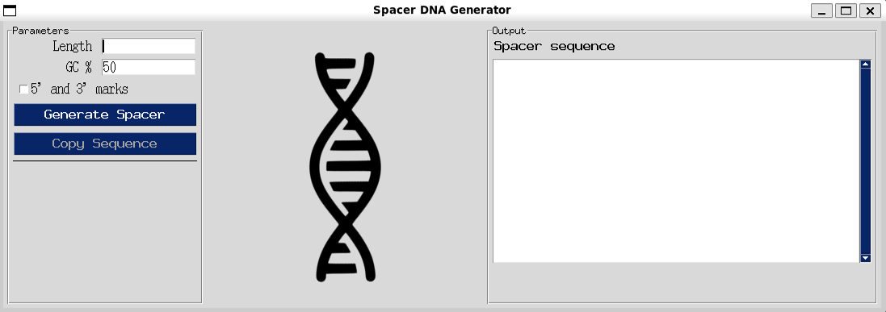

# Random DNA spacer generator
**Author:** Aleksander Gryciuk

**Version:** v1.0

---

## Introduction
Creating a random DNA sequence to **space** inserted genes is harder than it seems.  
This simple GUI generates random DNA spacer sequences with a desired GC content.  
The software uses the `secrets` module to make cryptographically strong random nucleotide choices.



## Installation
1. Create and activate the conda environment
```bash
conda env create -f requirements.yml
conda activate simple_gui
```
2. Run the script
```bash
python main.py
```

## Features
1. Length
- Spacer length must be in a range 10 - 5000 nt

2. %GC
- Select the desire GC content of the spacer
- Default value: 50%

3. 5' and 3' marks
- Add 5' and 3' markers to the output sting
- Markers can be toggled dynamically after spacer generation

